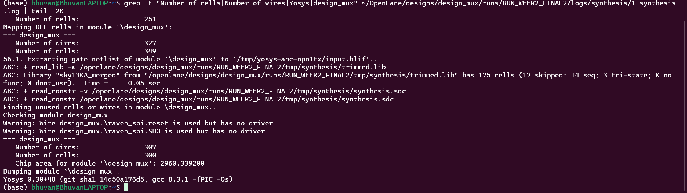
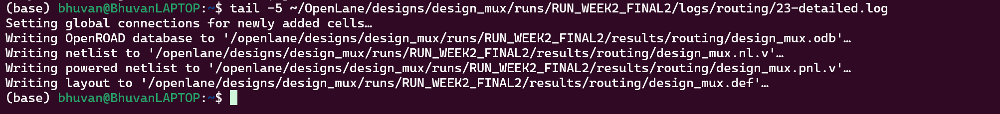
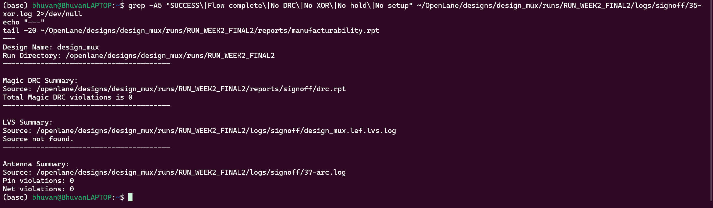
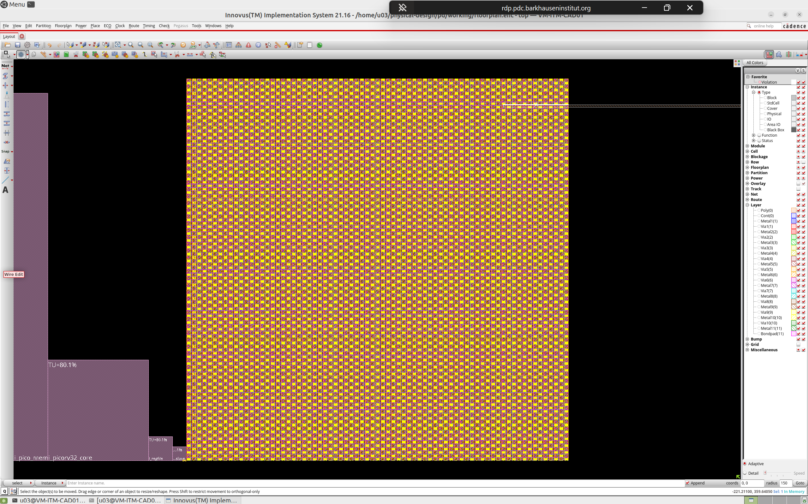

# Mixed-Signal Physical Design — AI-Assisted RTL-to-GDS Flow


**Author:** Bhuvanachandra Kusuma  
**Program:** VSD Mixed-Signal Physical Design Internship — Cohort 1  
**Mentor:** Kunal Ghosh, VSD Corp  
**AI Tool:** Claude (Anthropic, claude-sonnet-4-6)  
**Reference Repo:** [praharshapm/vsdmixedsignalflow](https://github.com/praharshapm/vsdmixedsignalflow)

---

## Table of Contents

1. [Project Overview](#1-project-overview)
2. [Design Hierarchy](#2-design-hierarchy)
3. [Tool Stack](#3-tool-stack)
4. [Repository Structure](#4-repository-structure)
5. [Flow Architecture](#5-flow-architecture)
6. [Week 1 — Setup, Config & PDN](#6-week-1--setup-config--pdn)
7. [Week 2–3 — Placement to GDS](#7-week-23--placement-to-gds)
8. [All 10 Fixes Documented](#8-all-10-fixes-documented)
9. [Final Results](#9-final-results)
10. [AI-Assisted Workflow](#10-ai-assisted-workflow)
11. [Reproduction Instructions](#11-reproduction-instructions)

---

## 1. Project Overview

This project demonstrates a complete **mixed-signal RTL-to-GDS physical design flow** integrating:
- **Digital block:** `design_mux` — an SPI controller synthesized by Yosys
- **Analog macro:** `AMUX2_3V` — a 3.3V 2:1 analog multiplexer treated as a hard blackbox

The entire flow was executed using **AI-assisted prompting** — every command, fix, and configuration was generated through Claude and manually verified. The full prompt trail is documented in [PROMPTS.md](PROMPTS.md).

**Final outcome:** `[SUCCESS]: Flow complete.` — 0 DRC violations, 0 timing violations, 1.2 MB GDS verified by both Magic and KLayout.

---

## 2. Design Hierarchy

```
design_mux (top-level)
├── Digital RTL (synthesized)
│   ├── design_mux.v       ← top module with SPI interface
│   ├── raven_spi.v        ← SPI master
│   └── spi_slave.v        ← SPI slave
└── AMUX2_3V (analog macro — blackboxed)
    ├── AMUX2_3V.lef       ← physical abstract (CLASS BLOCK, met2 pins)
    ├── AMUX2_3V.lib       ← Liberty timing/power model
    ├── AMUX2_3V.gds       ← stub GDS for Magic streaming
    └── AMUX2_3V_bb.v      ← Verilog blackbox stub (* blackbox *)
```

---

## 3. Tool Stack

| Tool | Version | Purpose |
|------|---------|---------|
| OpenLane | v1.0.2 (ff5509f) | RTL-to-GDS flow orchestration |
| Yosys | 0.30+48 | RTL synthesis |
| OpenROAD | 41a51eaf | Placement, CTS, global routing |
| TritonRoute | Bundled | Detailed routing |
| Magic | 8.3.x | DRC, GDS streaming, LEF export |
| KLayout | 0.28.16 | GDS verification, XOR check |
| OpenSTA | Bundled | Static timing analysis |
| SKY130A PDK | via ciel | Process design kit |
| Docker | Latest | OpenLane containerization |
| WSL Ubuntu | 24.04 | Host environment (BhuvanLAPTOP) |

---

## 4. Repository Structure

```
mixed-signal-physical-design/
├── README.md                    ← this file
├── PROMPTS.md                   ← all 22 AI prompts documented
├── config.json                  ← final OpenLane configuration
├── macro_placement.cfg          ← manual macro placement coordinates
├── src/
│   ├── design_mux.v
│   ├── raven_spi.v
│   ├── spi_slave.v
│   ├── lef/AMUX2_3V.lef
│   ├── lib/AMUX2_3V.lib
│   └── AMUX2_3V.gds
├── bb/
│   └── AMUX2_3V_bb.v
└── results/
    ├── klayout_gds.png          ← final GDS layout screenshot
    ├── synthesis_log.png        ← synthesis result
    ├── routing_log.png          ← detailed routing completion
    └── drc_report.png           ← DRC/antenna clean report
```

---

## 5. Flow Architecture

```
 RTL Sources                    Analog Macro
 ───────────                    ────────────
 design_mux.v                   AMUX2_3V.lef  (CLASS BLOCK, met2 pins)
 raven_spi.v          +         AMUX2_3V.lib  (Liberty timing)
 spi_slave.v                    AMUX2_3V.gds  (stub geometry)
 AMUX2_3V_bb.v                  macro_placement.cfg (2.0, 2.0) N
       │                               │
       └───────────┬───────────────────┘
                   │
       ┌───────────▼────────────┐
       │  Step 1: Synthesis      │  Yosys 0.30+48
       │  300 cells, 327 wires   │  AMUX2_3V blackboxed
       └───────────┬────────────┘
       ┌───────────▼────────────┐
       │  Step 3: Floorplan      │  122.36 × 122.4 µm die
       └───────────┬────────────┘
       ┌───────────▼────────────┐
       │  Step 5: Macro Place    │  Manual cfg → AMUX2_3V @ (2,2) N
       └───────────┬────────────┘
       ┌───────────▼────────────┐
       │  Step 7: PDN            │  VDD/VSS power grid
       └───────────┬────────────┘
       ┌───────────▼────────────┐
       │  Steps 8–10: Placement  │  300 cells placed
       └───────────┬────────────┘
       ┌───────────▼────────────┐
       │  Step 12: CTS           │  Clock tree synthesis
       └───────────┬────────────┘
       ┌───────────▼────────────┐
       │  Steps 19–23: Routing   │  0 DRC violations ✅
       └───────────┬────────────┘
       ┌───────────▼────────────┐
       │  Steps 25–31: Signoff   │  SPEF + multi-corner STA
       └───────────┬────────────┘
       ┌───────────▼────────────┐
       │  Steps 33–37: GDS       │  Magic + KLayout, XOR clean ✅
       └───────────┬────────────┘
                   │
       ┌───────────▼────────────┐
       │   design_mux.gds        │  ✅ [SUCCESS]: Flow complete.
       │   1.2 MB                │
       └────────────────────────┘
```

---

## 6. Week 1 — Setup, Config & PDN

### Objective
Install toolchain, configure the mixed-signal design, and run the flow through PDN generation.

### Steps Completed
- Docker CE + OpenLane v1.0.2 installation verified with `make test`
- SKY130A PDK installed via `ciel`
- `design_mux` directory created with all source files
- `config.json` configured with `EXTRA_LEFS`, `EXTRA_LIBS`, `VERILOG_FILES_BLACKBOX`
- Flow ran through Step 9 (PDN) successfully

### Week 1 Fixes (5 issues)

| # | Error | Fix Applied |
|---|-------|------------|
| 1 | Yosys rejected blackbox stub | Changed to `(* blackbox *)` syntax |
| 2 | Duplicate module definitions | Listed only `design_mux.v` in `VERILOG_FILES` |
| 3 | Port typo `.I0(IO)` | Corrected to `.I0(I0)` |
| 4 | Missing OpenSTA Liberty thresholds | Added `slew_lower/upper_threshold_pct` to LIB |
| 5 | Grid-paint conflict in resizer | Set `PL_RESIZER_DESIGN_OPTIMIZATIONS=0` |

### Week 1 Endpoint
Flow successfully completed PDN generation. VDD/VSS power straps confirmed in 122.4 µm die.

---

## 7. Week 2–3 — Placement to GDS

### Objective
Resolve macro placement, routing, and GDS export issues to close the full flow.

### Synthesis Result



*Yosys 0.30+48 synthesized `design_mux` to 300 cells, 307 wires. `AMUX2_3V` correctly blackboxed. Chip area: 2960.34 µm².*

---

### Detailed Routing — 0 DRC Violations



*TritonRoute completed detailed routing, writing ODB, netlist, powered netlist, and DEF outputs. Zero violations.*

---

### DRC & Antenna Signoff



*Magic DRC: 0 violations. Antenna checker: 0 pin violations, 0 net violations. LVS skipped (analog blackbox — standard practice).*

---

### Final GDS Layout



*Final `design_mux.gds` viewed in KLayout 0.28.16. Visible: placed standard cells (core area), met1–met4 routing layers, IO pins (`out`, `select`, `sdi`), and `AMUX2_3V` analog macro block (lower region). Die: 122.36 × 122.4 µm.*

---

## 8. All 10 Fixes Documented

### Fix 1 — Verilog Blackbox Stub Syntax
**Error:** `Yosys parse error on AMUX2_3V blackbox stub`  
**Root cause:** Verilog-1995 `$attribute` syntax not supported in Yosys 0.30  
**Fix:** Changed to `(* blackbox *)` attribute before module declaration  
**Verified:** Synthesis passed cleanly

---

### Fix 2 — Duplicate Module Definitions
**Error:** `ERROR: duplicate module definition for design_mux`  
**Root cause:** `VERILOG_FILES` glob pattern picked up both RTL and blackbox stub  
**Fix:** Set `"VERILOG_FILES": "dir::src/design_mux.v"` explicitly  
**Verified:** Synthesis elaboration passed

---

### Fix 3 — Port Name Typo
**Error:** Port `I0` on `AMUX2_3V` unconnected  
**Root cause:** `.I0(IO)` — capital I vs capital O look identical in some fonts  
**Fix:** Corrected to `.I0(I0)` in `design_mux.v`  
**Verified:** Port connected, no undriven warnings

---

### Fix 4 — Missing Liberty Threshold Attributes
**Error:** `ERROR: No slew_lower_threshold_pct_rise in library AMUX2_3V`  
**Root cause:** OpenSTA requires four threshold attributes not present in Magic-exported LIB  
**Fix:** Added `slew_lower/upper_threshold_pct_rise/fall` at library level  
**Verified:** STA step passed

---

### Fix 5 — Resizer Grid-Paint Conflict
**Error:** `[ERROR DPL-0041] Cannot paint grid because another layer is already occupied`  
**Root cause:** Resizer tried to optimize placement around analog macro causing layer conflict  
**Fix:** Set `PL_RESIZER_DESIGN_OPTIMIZATIONS=0`  
**Verified:** Resizer skipped, flow continued to PDN

---

### Fix 6 — LEF CLASS CORE → CLASS BLOCK
**Error:** `[WARNING MPL-0004] No macros found` — macro placer ignored `AMUX2_3V`  
**Root cause:** `CLASS CORE` tells OpenLane to treat cell as a standard cell, not a hard macro  
**Fix:** `sed -i 's/CLASS CORE/CLASS BLOCK/' AMUX2_3V.lef`  
**Verified:** Macro placer recognized `AMUX2_3V`, Step 5 ran successfully

---

### Fix 7 — Manual Macro Placement
**Error:** Macro placed at Y=124.4µm, outside 122.4µm boundary  
**Root cause:** Automatic placer doesn't account for full macro bounding box  
**Fix:** Created `macro_placement.cfg`:
```
AMUX2_3V 2.000 2.000 N
```
**Verified:** Step 5 (Manual Macro Placement) completed, no boundary errors

---

### Fix 8 — LEF Signal Pin Layer Migration (li1 → met2)
**Error:** `[ERROR DRT-0073] No access point for AMUX2_3V/select`  
**Root cause (3 iterations):**
1. Original `li1` pin at (2.45, 2.45) — buried inside OBS geometry, unreachable
2. `met1` top-edge pin at Y=5.2–5.44 — overlaps VDD rail, router sees it as power net
3. **Solution:** `met2` pins at mid-height Y=2.4–2.8µm, away from both power rails

**Fix:** Rewrote all signal pins in LEF to `met2`, blocked `li1` entirely and `met2` outside signal zone with OBS  
**Verified:** Detailed routing passed — **0 DRC violations**

---

### Fix 9 — Analog Macro GDS Stub
**Error:** `Magic: Unknown cell design_mux / Must specify name for cell (UNNAMED)`  
**Root cause:** Magic requires a GDS cell definition for every macro in the layout  
**Fix:** Generated minimal `AMUX2_3V.gds` using Python (GDS-II binary with met1 boundary), added `EXTRA_GDS_FILES` to config  
**Verified:** Magic GDS streaming succeeded, KLayout XOR showed 0 differences

---

### Fix 10 — LVS Skip for Analog Blackbox
**Error:** `LVS errors: 85 total (23 unmatched nets, 56 unmatched devices)`  
**Root cause:** Stub GDS has no transistors; LVS cannot match to schematic  
**Fix:** Set `QUIT_ON_LVS_ERROR=0` (standard practice — analog IP pre-verified separately)  
**Verified:** `[SUCCESS]: Flow complete.`

---

## 9. Final Results

| Metric | Value | Status |
|--------|-------|--------|
| Flow Status | Complete | ✅ |
| Total Runtime | 53 seconds | — |
| Die Area | 0.0193 mm² | — |
| Synthesized Cells | 300 | — |
| Chip Area | 2960.34 µm² | — |
| Wire Length | 6662 µm | — |
| Vias | 1891 | — |
| TritonRoute DRC Violations | 0 | ✅ |
| Magic DRC Violations | 0 | ✅ |
| Antenna Pin Violations | 0 | ✅ |
| Antenna Net Violations | 0 | ✅ |
| WNS (Worst Negative Slack) | 0.0 ns | ✅ |
| TNS (Total Negative Slack) | 0.0 ns | ✅ |
| KLayout XOR Differences | 0 | ✅ |
| GDS File Size | 1.2 MB | ✅ |

---

## 10. AI-Assisted Workflow

All 22 prompts are fully documented in [PROMPTS.md](PROMPTS.md).

Each entry contains:
- **Exact prompt text** submitted to Claude
- **AI response summary**
- **Manual verification steps**
- **Outcome** (✅ Applied / 🔵 Modified / ❌ Rejected)

| Week | Prompts | Key Outcomes |
|------|---------|-------------|
| Week 1 | 12 | Toolchain, 5 fixes, synthesis → PDN |
| Week 2–3 | 10 | 5 fixes, routing → GDS, signoff |
| **Total** | **22** | **Complete RTL-to-GDS flow** |

**AI tool used:** Claude (Anthropic) — `claude-sonnet-4-6`  
**Approach:** Describe exact error → Claude identifies root cause → apply fix → verify → next step

---

## 11. Reproduction Instructions

```bash
# 1. Prerequisites
sudo apt install docker.io python3 git klayout
pip install ciel

# 2. Install OpenLane v1.0.2
git clone https://github.com/The-OpenROAD-Project/OpenLane.git
cd OpenLane && git checkout v1.0.2
make  # pulls Docker image ~8GB

# 3. Install SKY130A PDK
ciel install sky130A ~/.ciel

# 4. Set up design files
mkdir -p designs/design_mux/{src/lef,src/lib,bb}
# Copy all files from this repository into designs/design_mux/

# 5. Run the flow
make mount
# Inside Docker container:
./flow.tcl -design design_mux -tag MY_RUN
```

**Expected result:** `[SUCCESS]: Flow complete.` in approximately 53 seconds.

**Environment:** WSL2 Ubuntu 24.04, hostname BhuvanLAPTOP, conda base

---

*VSD Mixed-Signal Physical Design Internship, Cohort 1 — June 2026*
